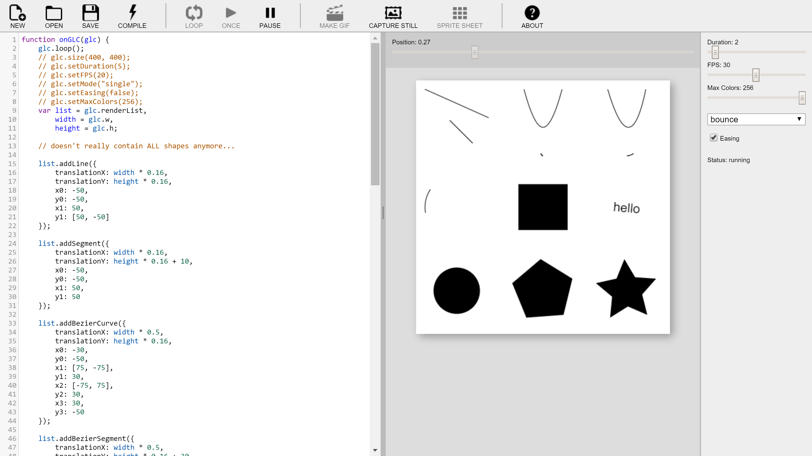
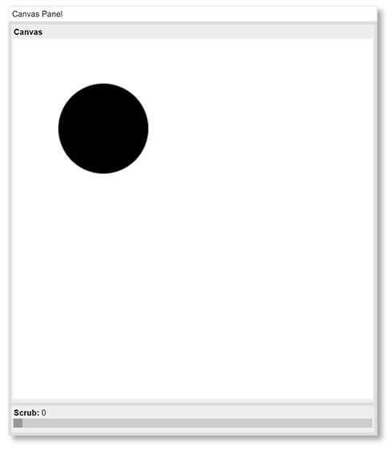
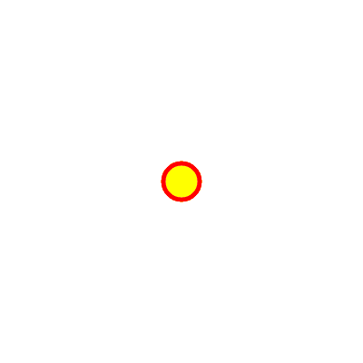
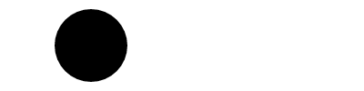

[Home](http://gifloopcoder.com)

# Introduction to GIF Loop Coder (GLC)

1.  Introduction to GIF Loop Coder (GLC)
  - [Getting Started](#gettingstarted)
  - [Adding Objects](#addingobjects)
  - [Animating](#animating)
  - [GLC User Interface](#ui)
  - [Animation Playback and Rendering](#playback)
2.  [Objects](objects.html)
3.  [Styles](styles.html)
4.  [Property Types](properties.html)
5.  [Tips and Advanced Use](tips.html)

I highly recommend you read through this first section to get an idea of how the program works and how to code objects and animations.

Then you can use the [Objects](objects.html), [Styles](styles.html), [Property Types](properties.html) and [Tips](tips.html) sections as a reference as needed. And don't forget to visit the [GLC Blog](http://www.gifloopcoder.com/blog) for new features, sample code and small tutorials.

### Getting Started

GIF Loop Coder (glc) is a JavaScript-based tool for creating looping animated gifs.

As of Version 1.3.0, the program is a standalone executable program that runs on Windows, OS X and Linux.

It provides a text editor where you can write JavaScript code to add animated objects to a render list.

Your code is then executed. This creates and animates the ojects you defined, gives you a control panel to control how the animation is rendered and lets you save the result as an animated gif.

You can check out the entire source repository from [https://github.com/bit101/gifloopcoder](https://github.com/bit101/gifloopcoder). Or, you can simply download a zip file that contains the files you need to run the app, some examples and this documentation. That latest zips for each platform are at [https://github.com/bit101/gifloopcoder/releases](https://github.com/bit101/gifloopcoder/releases).

On OS X, you'll see a `GIFLoopCoder.app` file and folders containing the documentation and example files. On Windows and Linux, you'll have the `docs` and `examples` folders plus an `app` folder containing the executable program and other support files. On Windows, the executable will be `GIFLoopCoder.exe` and on Linux simply `GIFLoopCoder`.

Whatever platform you are on, just run that executable file and you'll be up and running.

Now let's look at what makes up a sketch. The template looks like this:

    function onGLC(glc) {
        glc.loop();
        // glc.size(400, 400);
        // glc.setDuration(5);
        // glc.setFPS(20);
        // glc.setMode("single");
        // glc.setEasing(false);
        var list = glc.renderList,
            width = glc.w,
            height = glc.h,
            color = glc.color;

        // your code goes here:

    }             

The template creates an `onGLC` function that gets passed an object called `glc`. That object is all you need to work with the GLC library.

You can see that the template first calls `glc.loop();` This will cause the animation to auto-play when the sketch is loaded and compiled. And you'll see several other methods there, commented out. Those will be discussed a bit later. One I'll mention immediately is the `size` method. By default, GLC makes a 400x400 pixel animation. You can change that with this method, passing in a new width and height.

Animations are created by adding objects to the `glc.renderList`. Rather than typing that out each time, the template creates a short alias called `list` to make adding objects easier.

You'll also see that `glc.w` and `glc.h`, which represent the width and the height of the current sketch, are aliased to `width` and `height`, again for ease of typing.

Now you are ready to add some objects and animate them.

### Adding Objects

The `glc.renderList`, which we have aliased to `list`, has a number of "add" methods for adding objects. Let's start by adding a circle.

<pre><code>function onGLC(glc) {
    var list = glc.renderList;

    glc.loop();
    // glc.size(400, 400);
    // glc.setDuration(5);
    // glc.setFPS(20);
    // glc.setMode("single");
    // glc.setEasing(false);
    // glc.setMaxColors(256);

    // your code goes here:

    <b>list.addCircle();</b>

});</code></pre>

Now, there are many properties that go into defining a rendered circle: position, radius, stroked or filled or both? Stroke color and width, solid or dashed, fill color, drop shadow parameters. Circles are drawn in HTML5 using the `arc` method, so we also need to know the start and end angle of that arc. But we don't have to specify anything at all here because glc has defaults for everything. You only need define what you want to be different from the default.

You can run this sketch by clicking the "Compile" button on the tool bar, or pressing `Control-Enter` on the keyboard. When you do, you should see your circle right away.

*Note, some of the screenshots here show an older user interface for the canvas panel. But the graphics and animation themselves should be the same.*

Now that we have a circle, let's customize it by setting some of its properties. This is all done declaratively, by passing in an object to the `addCircle` method. Let's set the x and y position so that the circle is centered on the canvas.

    ...
    list.addCircle({
        x: 200,
        y: 200
    });
    ...

Now let's change its radius, and give it a stroke. Then a stroke and fill style (color).

<pre><code>
list.addCircle({
    x: 200,
    y: 200,
    <b>radius: 100,
    stroke: true,
    strokeStyle: "#ff0000",
    fillStyle: "yellow"</b>
});
</code></pre>

Notice that I set one style using a hex string, and the other using a CSS named color. Just about any standard color string will work. There's more on that in the [Properties](properties.html) section.

Now that we've seen how to add an object, let's look at how to animate it.

### Animating

Animation in glc is done through changing an object from one state to another over time. By state, I mean that the values of one or more of its properties are changed. So, rather than assigning a single value to a property, we animate it by assigning _two_ properties to it. And we do that by assigning an array to that property. For example, to animate the radius of this circle, we just pass in an array, like so:

<pre><code>
list.addCircle({
    x: 200,
    y: 200,
    <b>radius: [20, 100],</b>
    stroke: true,
    strokeStyle: "#ff0000",
    fillStyle: "yellow"
});
</code></pre>

Now you should be able to see the circle animating. You can use the stop button to stop it, and the scrubber under the animation to examine the animation frame-by-frame.

You can animate almost any property of any object. Even colors in any format - hex strings, rgb or rgba strings or even CSS named colors. You can even mix and match formats. It's all good!

<pre><code>
list.addCircle({
    x: 200,
    y: 200,
    radius: [20, 100],
    stroke: true,
    <b>strokeStyle: ["#f00", "#0000ff"],
    fillStyle: ["rgb(255, 255, 0)", "green"]</b>
});
</code></pre>

Here, the stroke will animate from red to blue, while the fill animates from yellow to green. You can even animate booleans!

<pre><code>
list.addCircle({
    x: 200,
    y: 200,
    radius: [20, 100],
    <b>stroke: [true, false],</b>
    strokeStyle: ["#f00", "#0000ff"],
    fillStyle: ["rgb(255, 255, 0)", "green"]
});
</code></pre>

Of course, there is no way to smoothly ramp up and down from true to false, so the object will get the first value for the first part of the animation and then switch over to the second boolean value. Here that means that the circle will be stroked when its radius is between 20 and 60 and unstroked when it's between 60 and 100.

Check the other sections of this documentation to find out the different types of objects you can add, the different types of properties you can assign to them and how to animate them. Next up, we'll take a closer look at the user interface.

### GLC User Interface

The key parts of the glc user interface are the tool bar, the code panel, canvas panel and the properties panel.

The canvas panel displays the animation in progress. It will be sized to 400x400 pixels, or differently if you called `glc.size` in your sketch. Note that at the top of the panel, there is a scrubber for moving through the animation manually. There is a splitter bar that you can use to adjust the relative sizes of the code and canvas panels.

First the toolbar. From left to right:

* The **New** button creates a new sketch. This will wipe out any existing sketch in the editor, so you'll be warned before this takes effect.
* The **Open** button lets you browse to and load a sketch file from your file system. This file will be loaded into the code editor and will be executed immediately. So if you set the sketch size, the canvas panel will resize and if you told the sketch to loop, it will start looping. Shortcut: Control-O
* The **Save** button saves your current sketch. If the sketch was opened from the file system or previously saved, it will silently save the file at the existing path. If it is a new file that has not been saved, it performs a "Save As" operation. Shortcut: Control-S
* The **Save As** button opens a save file dialog allowing you to save the current sketch to your file system. 
* The **Compile** button re-executes the code in the code editing area. You'll want to do this when you add or change some code and want to see what it does. The shortcut is Control-Enter. That's a good one to learn because you'll be using it a lot.
* The **Loop** button simply starts the animation playing continuously. Shortcut Control-Space will toggle between playing and paused.
* The **Once** button will play the animation through from start to finish one time.
* The **Pause** button pauses the animation.
* The **Make GIF** button causes the animation to play through one time and begins capturing frames. When the animation is done, it assembles the captured frames into an animated gif, which it displays in a lightbox-type overlay. Shortcut: Control-G
* The **Capture Still** button will capture the single frame showing in the Canvas panel and display it in the lightbox overlay.
* The **Sprite Sheet** button causes the animation to play through one time and begins capturing frames. When the animation is done, it assembles the captured frames into a sprite sheet, which it displays in the lightbox overlay.
* The **Image Sequence** button will open a file dialog asking you for a location and name to save the images. When you choose this, it will render each frame of the animation and save it as a separate png file in the specified location, with the specified name plus an index. For example, if you chose the name `myAnim.png` for a 30-frame animation, this would create files `myAnim_0000.png` through `myAnim_0029.png` in the folder you chose. Any files with the same name will be overwritten. You can create an animation with these images using the software of your choice.
* The **Console** button opens up the developer console. This can be useful for debugging a script if it's not doing what you want it to.
* The **About** button displays some information about the app.

Then there's the Control Panel. From top to bottom, here's what it does:

*   The **Duration** slider changes how long the overall animation lasts. It can go from 0.5 seconds up to 30 seconds, in 0.5 second increments.
*   The **FPS** slider sets the approximate frame rate in frames per second of the animation. This is accomplished by adding a small delay on each frame. It goes from 1 fps up to 60 fps.
*   The **Max Colors** slider sets how many colors will be used in the final animation. GIFs have a maximum of 256 colors. But often you can set the max colors much lower and still have your animation look good. This can make a dramatic difference in file size.
*   The **Mode** select allows you to choose "bounce" or "single". Modes will be explained a bit more below.
*   The **Easing** checkbox gives the animation an ease-in and ease-out to the animation if checked. Otherwise, it performs a straight linear interpolation.
*   The **Status** indicator lets you know what's happening
*   The **Object Snippets** dropdown lets you insert a pre-written snippet of code into the code panel that will define an object. Place the cursor at the point you want in the code, choose a snippet and click the insert button.
*   The **Other Snippets** dropdown lets you insert a useful, pre-defined snipped of code into the code panel. Place the cursor at the point you want in the code, choose a snippet and click the insert button. You can create your own snippets as well. This is covered in [the tips section](tips.html#snippets)

If you ever have a hard time getting one of the sliders to land on a specific value, you can also use the left and right cursor keys on your keyboard. Pressing these will move the slider in single increments one way or the other.

You can also interact with several of the controls here via the code you write. You've already seen that you can call `glc.loop()` to have your animation start looping as soon as the page loads. Alternately, you could `glc.playOnce()`. Here are all the available commands:

* `glc.loop()` - loops the animation continuously when the page loads.
* `glc.playOnce()` - plays the animation through one time when the page loads.
* `glc.size(w, h)` - sets the animation size.
* `glc.setFPS(num)` - sets the frame rate of the animation.
* `glc.setDuration(num)` - sets the duration of the animation.
* `glc.setMode(mode)` - sets the interpolation mode ("bounce" or "single").
* `glc.setEasing(bool)` - sets easing on or off.
* `glc.setMaxColors(num)` - sets the maximum number of colors in your animation.
*   `glc.setQuality(num)` - sets the quality of the color quantization process. See [the tips section](tips.html#quality) for details on this.

Many of these settings duplicate what you see in the control panel. But setting them right in your sketch allows you to save those settings with your sketch, and the next time you reload that sketch, it will be played back and rendered the same way.

Finally, the lightbox overlay panel displays the generated gif or captured image as well as some information such as the image size and the approximate file size of the images. You can right click it to save it in a specific location with a specific name, or open it in a new tab. Sometimes the right-click to save action will fail on larger animations. If this happens, try dragging and dropping the image into a file system window.

If the image is larger than the screen, which will often be the case with sprite sheets, it will be scaled to fit within the screen. However, the image itself will be full resolution when saved. Save the images or open it in a new tab to see it full size.

To hide the overlay panel, click the close button or press the escape key.

### Animation Playback and Rendering

At the very core of a glc animation is a single property, `t` that interpolates from 0 to 1. It's at 0 at the start of the animation and 1 at the end. And an ever-increasing fraction in between.

First lets look at what happens when mode is set to "bounce". Say you've assigned an array of two values to a property, such as `x: [100, 300]` to a circle's x position. glc will animate that circle so that it increases from an x of 100, up to 300, and then back down to 100 again. That's one cycle of an animation.

So, when `t` = 0, `x` will get 100. As `t` increases, the x position will start moving from the 100, towards its second value, 300. When `t` reaches 0.5, it's half way through the animation, and `x` will be 300. As `t` increases from 0.5 to 1.0, the x position of the circle will start moving back downwards toward the first value, 100.

If easing is checked in the Control Panel, then `t` will change on a curve defined by a sine wave, so it starts increasing slowly, then speeds up, and then slows down as it reaches the end. If easing is off, it just linearly moves from 0 to 1.

You can see this very clearly by using the scrubber on the Canvas Panel. The value shown there is the `t` value. When the slider is full left, `t` is 0 and your animation will be at the starting state. As you drag right, `t` increases and your animation moves towards the ending state. It should reach that end state just as the slider hits the midpoint at `t` = 0.5, then start moving back to the starting point as you continue to drag right to `t` = 1.

Now, when the mode is set to "single", we have a very different operation. Here, the animation only goes from its start state at `t` = 0 to its end state at `t` = 1. You can see this very clearly as well by using the scrubber in the Canvas Panel. First with easing:

And then without easing:

Most animations look best in bounce mode because they will automatically loop very smoothly. If you simply move an object in single mode, it will move from its start position to the end position and then suddenly jump back to the start position and start over. To make a good looking single mode animation requires some extra work, usually additional objects to make the overall start state of the animation look exactly the same as the end state. But if done correctly, these can look really great.

There is more information on how to do this in the [Tips](tips.html) section.
