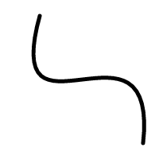
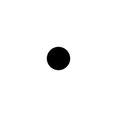
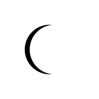
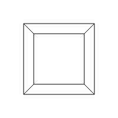
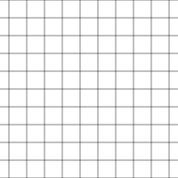
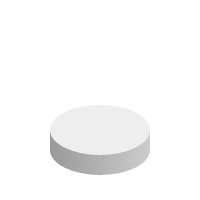
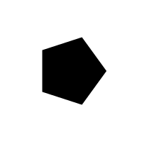
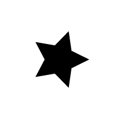
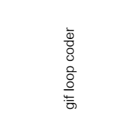
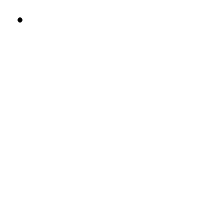

[Home](http://gifloopcoder.com)

# GIF Loop Coder (GLC) Documentation

Table of Contents

1.  [Introduction to GIF Loop Coder (GLC)](intro.html)
2.  Objects
  - [Arrow](#arrow)
  - [BezierCurve](#beziercurve)
  - [Circle](#circle)
  - [Container](#container)
  - [Cube](#cube)
  - [Curve](#curve)
  - [Crescent](#crescent)
  - [Gear](#gear)
  - [Grid](#grid)
  - [Heart](#heart)
  - [Image](#image)
  - [Isobox](#isobox)
  - [Isotube](#isotube)
  - [Line](#line)
  - [Oval](#oval)
  - [Path](#path)
  - [Poly](#poly)
  - [Ray](#ray)
  - [Rect](#rect)
  - [Spiral](#spiral)
  - [Star](#star)
  - [Text](#text)
  - [Segment Objects](#segments)
      + [Segment](#segment)
      + [ArcSegment](#arcsegment)
      + [BezierSegment](#beziersegment)
      + [CurveSegment](#curvesegment)
      + [RaySegment](#raysegment)
3.  [Styles](styles.html)
4.  [Property Types](properties.html)
5.  [Tips and Advanced Use](tips.html)

## Objects

Objects are created by calling various "add" methods on the `glc.renderList`, passing in a generic object with properties. All of the add methods can be called with no paramters or an empty object to create a default object of that type. The properties passed in override any defaults. Each object has its own specific properties that will define that object, such as, `x, y, radius`, etc. for a circle, or `x0, y0, x1, y1`, etc. for a line.

In addition, all objects can accept a number of "style" properties, such as `strokeStyle, fillStyle, lineWidth`, various shadow properties, etc. Of course, some of these style properties may not be applicable to a particular object, such as a fill style when drawing a line.

Read more about style properties in the [Styles](#styles) section. This section will cover only object-specific properties.

All of the properties of all of the objects listed here, and all of the styles properties that can be defined on objects are animatable. It may seem unclear how you can animate a string of text or a boolean value. This is covered in detail in the [Property Types](properties) section.

All of these add methods will return a reference to the object just created. This can be used to make this object the parent of other objects. More info on how to use parenting can be found in the [Tips Section](tips.html#parent)

### Arrow

An arrow object is created with:

    glc.renderList.addArrow(properties);

This draws an arrow shape.

In addition to the standard style properties described in the next section, this method can accept the following properties. Defaults are listed in parentheses. All of these properties are animatable.

    x (100)             The x value of the center of the arrow.
    y (100)             The y value of the center of the arrow.
    w (100)             The width of the arrow.
    h (100)             The height of the arrow.
    pointPercent (0.5)  The percent of the width of the arrow that the point will take up.
    shaftPercent (0.5)  The percent of the height of the arrow that the shaft will take up 
    rotation (0)        The rotation of the object.
    stroke (false)      Whether the object will be stroked.
    fill (true)         Whether the object will be filled.
    scaleX (1)          The scale of the object on the x axis.
    scaleY (1)          The scale of the object on the y axis.

### BezierCurve

A bezier curve object is created with:

    glc.renderList.addBezierCurve(properties);

This draws a standard bezier curve using four points.

In addition to the standard style properties described in the next section, this method can accept the following properties. Defaults are listed in parentheses. All of these properties are animatable.

    x0 (50)             The x value of the first point.
    y0 (10)             The y value of the first point.
    x1 (200)            The x value of the second point.
    y1 (100)            The y value of the second point.
    x2 (0)              The x value of the third point.
    y2 (100)            The y value of the third point.
    x3 (150)            The x value of the fourth point.
    y3 (10)             The y value of the fourth point.
    showPoints (false)  Whether the control points of the curve will be drawn.

### Circle

A circle object is created with:

    glc.renderList.addCircle(properties);

This draws a circle. Because circles are drawn using the arc command in HTML5, this object also draws arcs by setting the start and end angles.

In addition to the standard style properties described in the next section, this method can accept the following properties. Defaults are listed in parentheses. All of these properties are animatable.

    x (100)                 The x position of the circle.
    y (100)                 The y position of the circle.
    radius (50)             The radius of the circle.
    startAngle (0)          The start angle of the arc. (degrees)
    endAngle (360)          The end angle of the arc. (degrees)
    rotation (0)            The rotation of the circle. (degrees).
    stroke (false)          Whether the object will be stroked.
    fill (true)             Whether the object will be filled.
    drawFromCenter (false)  If true, starts and ends the drawing at the center of the circle rather than points on the radius.
    scaleX (1)              The scale of the object on the x axis.
    scaleY (1)              The scale of the object on the y axis.

### Container

A container object is created with:

    glc.renderList.addContainer(properties);

This creates an empty shape that other shapes can be added to. The container can be positioned on the x, y axes and rotated. More info on how to use parenting can be found in the [Tips Section](tips.html#parent)

Because the container does not draw anything, any style properties will be ignored. The following properties can be used on a container. All of these properties are animatable.

    x (0)               The x position of the container.
    y (0)               The y position of the container.
    rotation (0)        The rotation of the container. (degrees).
    scaleX (1)          The scale of the object on the x axis.
    scaleY (1)          The scale of the object on the y axis.

### Crescent

A crescent object is created with:

    glc.renderList.addCrescent(properties);

This draws a crescent. In GLC, a crescent is a circle with part of another circle of the same radius subtracted from it.

In addition to the standard style properties described in the next section, this method can accept the following properties. Defaults are listed in parentheses. All of these properties are animatable.

    x (100)                 The x position of the crescent.
    y (100)                 The y position of the crescent.
    radius (50)             The radius of the crescent.
    percent (0.5)           How much of the original circle will be visible. At 0, the circle will be completely eclipsed. At 1, it will be completely visible.
    rotation (0)            The rotation of the crescent. (degrees).
    stroke (false)          Whether the object will be stroked.
    fill (true)             Whether the object will be filled.
    scaleX (1)              The scale of the object on the x axis.
    scaleY (1)              The scale of the object on the y axis.

### Cube

A cube object is created with:

    glc.renderList.addCube(properties);

This draws a wireframe cube. At this time, only a stroke is available, no fill.

In addition to the standard style properties described in the next section, this method can accept the following properties. Defaults are listed in parentheses. All of these properties are animatable.

    x (100)         The position value of the cube.
    y (100)         The position value of the cube.
    z (0)           The x position of the cube.
    size (100)      The size of the cube.
    rotationX (0)   The rotation of the cube on the x-axis (degrees).
    rotationY (0)   The rotation of the cube on the y-axis (degrees).
    rotationZ (0)   The rotation of the cube on the z-axis (degrees).
    scaleX (1)      The scale of the object on the x axis.
    scaleY (1)      The scale of the object on the y axis.

### Curve

A curve object is created with:

    glc.renderList.addCurve(properties);

This draws a standard quadratic curve using three points.

In addition to the standard style properties described in the next section, this method can accept the following properties. Defaults are listed in parentheses. All of these properties are animatable.

    x0 (20)             The x value of the first point.
    y0 (20)             The y value of the first point.
    x1 (100)            The x value of the second point.
    y1 (200)            The y value of the second point.
    x2 (180)            The x value of the third point.
    y2 (20)             The y value of the third point.
    showPoints (false)  Whether the control points of the curve will be drawn.

### Gear

A gear object is created with:

    glc.renderList.addGear(properties);

This draws a toothed gear.

In addition to the standard style properties described in the next section, this method can accept the following properties. Defaults are listed in parentheses. All of these properties are animatable.

    x (100)             The x position of the gear.
    y (100)             The y position of the gear.
    radius (50)         The outer radius of the gear.
    teeth (10)          The number of teeth on the gear.
    toothHeight (10)    The height of the gear's teeth.
    toothAngle (0.3)    Controls the angle of the sides of the teeth (0 - 1).
    hub (10)            The radius of the hub of the gear (inner circle).
    rotation (0)        The rotation of the gear. (degrees).
    stroke (false)      Whether the object will be stroked.
    fill (true)         Whether the object will be filled.
    scaleX (1)          The scale of the object on the x axis.
    scaleY (1)          The scale of the object on the y axis.

### Grid

A grid object is created with:

    glc.renderList.addGrid(properties);

This draws a grid on the animation.

In addition to the standard style properties described in the next section, this method can accept the following properties. Defaults are listed in parentheses. All of these properties are animatable.

    x (0)               The x position of the grid.
    y (0)               The y position of the grid.
    w (100)             The width of the grid.
    h (100)             The height of the grid.
    gridSize (20)       The size of one cell in the grid.

### Heart

A heart object is created with:

    glc.renderList.addHeart(properties);

This draws a heart shape.

In addition to the standard style properties described in the next section, this method can accept the following properties. Defaults are listed in parentheses. All of these properties are animatable.

    x (100)         The x position of the heart.
    y (100)         The y position of the heart.
    w (50)          The width of the heart.
    h (50)          The height of the heart.
    rotation (0)    The rotation of the heart. (degrees).
    stroke (false)  Whether the object will be stroked.
    fill (true)     Whether the object will be filled.
    scaleX (1)      The scale of the object on the x axis.
    scaleY (1)      The scale of the object on the y axis.

### Image

An image object is created with:

    glc.renderList.addImage(properties);

This loads and draws an image from an external file.

In addition to the standard style properties described in the next section, this method can accept the following properties. Defaults are listed in parentheses. All of these properties are animatable.

    x (100)                 The x position of the image.
    y (100)                 The y position of the image.
    w (50)                  The width of the image.
    h (50)                  The height of the image.
    rotation (0)            The rotation of the image. (degrees).
    url ("")                The url of the image you want to load.
    drawFromCenter  (true)  Whether the image is drawn from the center or the top left corner.
    smooth (true)           Whether imageSmoothingEnabled is applied when drawing the image.
    scaleX (1)              The scale of the object on the x axis.
    scaleY (1)              The scale of the object on the y axis.

The image object can load files from the local file system or from any available network source. Images will be drawn at their original size if `w` and `h` are not set. Note that large images may take a few seconds to load. The animation will begin immediately however, drawing an empty image until such time as the image does finally load.

### Isobox

An isometric box object is created with:

    glc.renderList.addIsobox(properties);

This draws an isometric box.

In addition to the standard style properties described in the next section, this method can accept the following properties. Defaults are listed in parentheses. All of these properties are animatable.

    x (100)                 The x position of the isobox.
    y (100)                 The y position of the isobox.
    size (60)               The size of the isobox.
    h (40)                  The height of the isobox.
    colorTop (#eeeeee)      The color of the top of the isobox.
    colorLeft (#999999)     The color of the left side of the isobox.
    colorRight (#cccccc)    The color of the right side of the isobox.
    stroke (false)          Whether the object will be stroked.
    fill (true)             Whether the object will be filled.
    scaleX (1)              The scale of the object on the x axis.
    scaleY (1)              The scale of the object on the y axis.

Note: a good way to assign colors to the faces is to use `color.hsv()` with the same hue but differing values. For example:

    list.addIsobox({
        colorTop: color.hsv(40, 1, 1),       // bright 
        colorRight: color.hsv(40, 1, 0.75),  // darker
        colorLeft: color.hsv(40, 1, 0.5)     // darkest
    });

### Isotube

An isometric tube object is created with:

    glc.renderList.addIsotube(properties);

This draws an isometric tube.

In addition to the standard style properties described in the next section, this method can accept the following properties. Defaults are listed in parentheses. All of these properties are animatable.

    x (100)                 The x position of the isotube.
    y (100)                 The y position of the isotube.
    size (60)               The size of the isotube.
    h (40)                  The height of the isotube.
    colorTop (#eeeeee)      The color of the top of the isotube.
    colorLeft (#999999)     The color of the left side of the isotube.
    colorRight (#cccccc)    The color of the right side of the isotube.
    stroke (false)          Whether the object will be stroked.
    fill (true)             Whether the object will be filled.
    scaleX (1)              The scale of the object on the x axis.
    scaleY (1)              The scale of the object on the y axis.

Note: a good way to assign colors to the faces is to use `color.hsv()` with the same hue but differing values. For example:

    list.addIsotube({
        colorTop: color.hsv(40, 1, 1),       // bright 
        colorRight: color.hsv(40, 1, 0.75),  // darker
        colorLeft: color.hsv(40, 1, 0.5)     // darkest
    });

Note 2: the isotube object uses a linear gradient to shade the bottom part of the tube. This can result in many different colors being used in the image, which can result in poor gif rendering where there are only 256 colors available. If you use this object and want to render to gif, consider the following guidelines:

- Try not to use multiple isotubes in a single animation.
- If you do have multiple isotubes, try to make them use the same colors.
- An isotube with a smaller radius will have a smaller gradient and probably fewer colors than one with a larger radius.

### Line

A line object is created with:

    glc.renderList.addLine(properties);

This simply draws a line between two points.

In addition to the standard style properties described in the next section, this method can accept the following properties. Defaults are listed in parentheses. All of these properties are animatable.

    x0 (0)      The x value of the first point.
    y0 (0)      The y value of the first point.
    x1 (100)    The x value of the second point.
    y1 (100)    The y value of the second point.

### Oval

A oval object is created with:

    glc.renderList.addOval(properties);

This draws an oval using values `rx` and `ry` for the x and y radius. Because this is done using the arc command in HTML5, this object also draws oval-based arcs by setting the start and end angles.

In addition to the standard style properties described in the next section, this method can accept the following properties. Defaults are listed in parentheses. All of these properties are animatable.

    x (100)                 The x position of the oval.
    y (100)                 The y position of the oval.
    rx (50)                 The x radius of the oval.
    ry (50)                 The y radius of the oval.
    startAngle (0)          The start angle of the arc. (degrees)
    endAngle (360)          The end angle of the arc. (degrees)
    rotation (0)            The rotation of the oval. (degrees).
    stroke (false)          Whether the object will be stroked.
    fill (true)             Whether the object will be filled.
    drawFromCenter (false)  If true, starts and ends the drawing at the center of the oval rather than points on the radius.
    scaleX (1)              The scale of the object on the x axis.
    scaleY (1)              The scale of the object on the y axis.

### Path

A path object is created with:

    glc.renderList.addPath(properties);

This draws a series of line segments between a list of points.

In addition to the standard style properties described in the next section, this method can accept the following properties. Defaults are listed in parentheses. All of these properties are animatable.

    path ([])           An array of points in the format [x0, y0, x1, y1, etc]
    startPercent (0)    Drawing will start at the specified percent of the path.
    endPercent (1)      Drawing will end at the specified percent of the path.

The path can be an array of arrays, in which case it will animate between the two different paths. Ideally, the paths would have the same number of points. If not, glc will use the length of the shorter array, and excess points in the longer one will be ignored.

### Poly

A poly object is created with:

    glc.renderList.addPoly(properties);

This draws a multi-sided polygon.

In addition to the standard style properties described in the next section, this method can accept the following properties. Defaults are listed in parentheses. All of these properties are animatable.

    x (100)         The x position of the polygon.
    y (100)         The y position of the polygon.
    radius (50)     The radius of the polygon.
    sides (5)       The number of sides in the polygon.
    rotation (0)    The rotation of the polygon. (degrees).
    stroke (false)  Whether the object will be stroked.
    fill (true)     Whether the object will be filled.
    scaleX (1)      The scale of the object on the x axis.
    scaleY (1)      The scale of the object on the y axis.

### Rect

A rect object is created with:

    glc.renderList.addRect(properties);

This draws a rectangle. By default the x, y position represents the center of the rectangle. This also means the rectangle will pivot on its center if rotated. This can be changed with the `drawFromCenter` property. Setting this to false means the rectangle will be drawn from and pivot on the top left corner.

In addition to the standard style properties described in the next section, this method can accept the following properties. Defaults are listed in parentheses. All of these properties are animatable.

    x (100)         The x value of the rectangle.
    y (100)         The y value of the rectangle.
    w (100)         The width value of the rectangle.
    h (100)         The height value of the rectangle.
    rotation (0)    The rotation of the rectangle. (degrees)
    drawFromCenter  (true)  Whether the rectangle is drawn from the center or the top left corner.
    stroke (false)  Whether the object will be stroked.
    fill (true)     Whether the object will be filled.
    scaleX (1)      The scale of the object on the x axis.
    scaleY (1)      The scale of the object on the y axis.

### Ray

A ray object is created with:

    glc.renderList.addRay(properties);

This simply draws a line the same as the line object, but rather than specifying the line with x0, y0, x1, y1 properties, here you specify the starting point of the line, a length and an angle. You could do this with a line by manually calculating the end points. This just makes it easier.

In addition to the standard style properties described in the next section, this method can accept the following properties. Defaults are listed in parentheses. All of these properties are animatable.

    x (100)         The x value of the line.
    y (100)         The y value of the line.
    length (100)    The length value of the line.
    angle (0)       The angle value of the line.

### Spiral

A spiral object is created with:

    glc.renderList.addSpiral(properties);

This draws a spiral.

In addition to the standard style properties described in the next section, this method can accept the following properties. Defaults are listed in parentheses. All of these properties are animatable.

    x (100)             The x position of the spiral.
    y (100)             The y position of the spiral.
    innerRadius (10)    The inner radius of the spiral.
    outerRadius (90)    The outer radius of the spiral.
    turns (6)           The number of turns in the spiral (negative values make it turn in the other direction).
    res (1)             The spiral is drawn as a series of tiny line segments. This is the angle of each of those segments (degrees).
    rotation (0)        The rotation of the spiral. (degrees).
    stroke (false)      Whether the object will be stroked.
    fill (true)         Whether the object will be filled.
    scaleX (1)          The scale of the object on the x axis.
    scaleY (1)          The scale of the object on the y axis.

### Star

A star object is created with:

    glc.renderList.addStar(properties);

This draws a multi-pointed star.

In addition to the standard style properties described in the next section, this method can accept the following properties. Defaults are listed in parentheses. All of these properties are animatable.

    x (100)             The x position of the star.
    y (100)             The y position of the star.
    innerRadius (25)    The inner radius of the star.
    outerRadius (50)    The outer radius of the star.
    points (5)          The number of points in the star.
    rotation (0)        The rotation of the star. (degrees).
    stroke (false)      Whether the object will be stroked.
    fill (true)         Whether the object will be filled.
    scaleX (1)          The scale of the object on the x axis.
    scaleY (1)          The scale of the object on the y axis.

### Text

A text object is created with:

    glc.renderList.addText(properties);

This draws a string of text.

In addition to the standard style properties described in the next section, this method can accept the following properties. Defaults are listed in parentheses. All of these properties are animatable.

    x (100)                     The x position of the text.
    y (100)                     The y position of the text.
    text ("hello")              The string that will be drawn.
    fontSize (20)               The size of the font, in pixels.
    fontWeight ("normal")       The weight of the font (normal, bold, etc).
    fontFamily ("sans-serif")   The font family.
    fontStyle ("normal")        The style of the font (normal, italic, etc).
    rotation (0)                The rotation of the text. (degrees).
    stroke (false)              Whether the object will be stroked.
    fill (true)                 Whether the object will be filled.
    scaleX (1)                  The scale of the object on the x axis.
    scaleY (1)                  The scale of the object on the y axis.

## Segment Objects

The next group of objects are special as they will animate even if you don't supply pairs of properties. They create a path - either a line, a curve, a bezier curve or an arc, and stroke a portion of that path on each frame. That segment will move along from the start of the path to the end of it, and then back again if you are in bounce mode. Looking at the examples below is the easiest way to understand it.

Each of the segment objects has a property that controls how long that segment will be. For the line segment, it's simply a length. For the arc segment, it's an arc angle in degrees. For the two types of curve segments, it's a percentage value. How this relates to the actual length of the segment compared to the length of the curve is complex. It's not actually a percentage of the length. The segment will be longer at the start and end of the curve and shorter in the center. But it is true that the higher the percent value, the longer the segment will be.

Of course, you can also animate any other properties of the arc objects the same way you can do with any other object. If done right, there are some great effects possible with these.

### Segment

A segment object is created with:

    glc.renderList.addSegment(properties);

This creates a line using two points, but only draws a portion of that line. The drawn segment will animate from the beginning of the line to the end of it during the animation (and back to the beginning if mode = "bounce").

In addition to the standard style properties described in the next section, this method can accept the following properties. Defaults are listed in parentheses. All of these properties are animatable.

    x0 (0)              The x value of the first point.
    y0 (0)              The y value of the first point.
    x1 (100)            The x value of the second point.
    y1 (100)            The y value of the second point.
    segmentLength (50)  The length of the segment that will be drawn.

### ArcSegment

An arc segment object is created with:

    glc.renderList.addArcSegment(properties);

This creates an arc at an x, y point with a radius and start/end angles, but only draws a portion of that arc. The drawn segment will animate from the start angle to the end angle during the animation (and back to the start angle if mode = "bounce").

In addition to the standard style properties described in the next section, this method can accept the following properties. Defaults are listed in parentheses. All of these properties are animatable.

    x (100)         The x position of the arc.
    y (100)         The y position of the arc.
    radius (50)     The radius of the arc.
    startAngle (0)  The start angle of the arc. (degrees)
    endAngle (360)  The end angle of the arc. (degrees)
    rotation (0)    The rotation of the arc. (degrees)
    stroke (false)  Whether the object will be stroked.
    arc (20)        The angle of the arc that will be drawn. (degrees)

### BezierSegment

A bezier segment object is created with:

    glc.renderList.addBezierSegment(properties);

This creates a standard bezier curve using four points, but only draws a portion of that curve. The drawn segment will animate from the beginning of the curve to the end of it during the animation (and back to the beginning if mode = "bounce").

In addition to the standard style properties described in the next section, this method can accept the following properties. Defaults are listed in parentheses. All of these properties are animatable.

    x0 (50)             The x value of the first point.
    y0 (10)             The y value of the first point.
    x1 (200)            The x value of the second point.
    y1 (100)            The y value of the second point.
    x2 (0)              The x value of the third point.
    y2 (100)            The y value of the third point.
    x3 (150)            The x value of the fourth point.
    y3 (10)             The y value of the fourth point.
    percent (0.1)       The percent of the bezier curve on which the segment will be drawn. Higher percent means a longer segment.
    showPoints (false)  Whether the control points of the curve will be drawn.

### CurveSegment

A curve segment object is created with:

    glc.renderList.addCurveSegment(properties);

This creates a standard quadratic curve using three points, but only draws a portion of that curve. The drawn segment will animate from the beginning of the curve to the end of it during the animation (and back to the beginning if mode = "bounce").

In addition to the standard style properties described in the next section, this method can accept the following properties. Defaults are listed in parentheses. All of these properties are animatable.

    x0 (20)             The x value of the first point.
    y0 (20)             The y value of the first point.
    x1 (100)            The x value of the second point.
    y1 (200)            The y value of the second point.
    x2 (180)            The x value of the third point.
    y2 (20)             The y value of the third point.
    percent (0.1)       The percent of the quadratic curve on which the segment will be drawn. Higher percent means a longer segment.
    showPoints (false)  Whether the control points of the curve will be drawn.

### Ray Segment

A ray segment object is created with:

    glc.renderList.addRaySegment(properties);

This simply draws a segment the same as the segment object, but rather than specifying the line with x0, y0, x1, y1 properties, here you specify the starting point of the line, a length and an angle. You could do this with a segment by manually calculating the end points. This just makes it easier.

In addition to the standard style properties described in the next section, this method can accept the following properties. Defaults are listed in parentheses. All of these properties are animatable.

    x (100)             The x value of the line.
    y (100)             The y value of the line.
    length (100)        The length value of the line.
    angle (0)           The angle value of the line.
    segmentLength (50)  The length of the segment that will be drawn.

