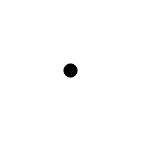
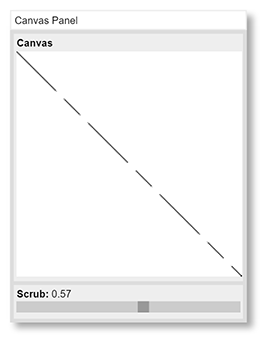
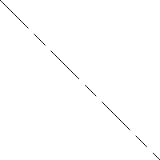

[Home](http://gifloopcoder.com)

# GIF Loop Coder (GLC) Documentation

Table of Contents 

1.  [Introduction to GIF Loop Coder (GLC)](intro.html)
2.  [Objects](objects.html)
3.  [Styles](styles.html)
4.  Property Types
  - [Number](#number)
  - [String](#string)
  - [Color](#color)
  - [Boolean](#boolean)
  - [Array](#array)
5.  [Tips and Advanced Use](tips.html)

## Properties

This section discusses the different types of properties, and the kind of data that you can assign to each one of them.

### Number

A number property is pretty simple to understand. You can assign a single number of course:

    radius: 100

This will result in that property having that value at all times.

Or you can assign a 2-element array:

    radius: [100, 200]

This smoothly interpolates the value from the first element to the second one over the course of the animation.

An additional method is to assign a larger array of values to the property:

    radius: [10, 40, 70, 100]

In this case, the property will cycle through the values in the array as the animation progresses. Note, that it will NOT smoothly interpolate between the values. In the example above where there are four values, the first value will be used while `t` is between 0 and 0.25\. When `t` is between 0.25 and 0.5, the second value will be assigned to the property, and so on, with the third value for `t` between 0.5 and 0.75 and value four for 0.75 - 1.0

Finally, if none of these work for you, you can assign a function to the property, in the format:

    radius: function(t) {
        return someValue;
    }

This is the most powerful method, allowing you to do whatever calculations you want based on the `t` value, and return any value you want. For example, the following code uses a sine wave to oscillate and object back and forth across the canvas, based on `t`:

    list.addCircle({
        x: function(t) {
            return 100 + Math.sin(t * Math.PI * 2) * 100;
        },
        y: [0, 200],
        radius: 20
    });

Remember that `t` will vary from 0 to 1, so here we multiply it by `Math.PI * 2` to get an angle that will complete a full cycle of the sine wave.

### String

A string property is also quite simple. Again, you can assign a simple string:

    text: "hello"

You can also assign an array of values to the property:

    text: ["hello", "goodbye"]

or...

    text: ["small", "medium", "large"]

This will function in the same way as a number array, with the difference that even a 2-element array will work this way.

In the first example, text will be assigned the string "hello" for the first half of the animation, and "goodbye" for the last half.

In the second example, text will be assigned "small" for the first third of the animation, "medium" for the middle third, and "large" for the last third

And again you can assign a function to the property, in the format:

    text: function(t) {
        return someString;
    }

For example:

    text: function(t) {
        return "t = " + t;
    }

This will return a string telling you the current value of t, for whatever that's worth. The sky is the limit here.

### Color

You can simply assign any valid color string, as you would in addressing Canvas directly. Examples:

Hex strings:

    fillStyle: "#ff0000"

or...

    fillStyle: "#f00"

rgb strings:

    fillStyle: "rgb(255, 0, 0)"

rgba strings:

    fillStyle: "rgba(255, 0, 0, 0.5)"

CSS color named color strings:

    fillStyle: "fuchsia"

To smoothly animate between two colors, supply a 2-element array:

    fillStyle: ["#ff0000", "#00ff00"]

This works with ALL kinds of strings described above. You can even mix and match them. All of the following are exactly equivalent and will create a smooth interpolation:

    fillStyle: ["#ff0000", "green"]
    fillStyle: ["#f00", "rgb(0, 255, 0)"]
    fillStyle: ["red", "rgba(0, 255, 0, 1)"]
    fillStyle: ["rgb(255, 0, 0)", "#00ff00"]
    fillStyle: ["rgba(255, 0, 0, 1)", "#0f0"]

Even something as crazy as this works:

    fillStyle: ["burlywood", "mediumorchid"]

Yes, that will animated between those two colors just fine. CSS color names are also case insensitive, so you can type "burlywood", "BurlyWood", "BURLYWOOD" or even "bUrLyWoOd" if you are so inclined.

A word on alpha channels. You can specify the alpha channel of a color two ways:

1\. With an rgba string: `"rgba(255, 0, 0, 0.5)"`

2\. With a hex string: `"#80ff0000"`.

Both of the above examples will give you a red color with 50% transparency. Specifying colors any other way will give you full alpha.

`"red"`, `"#ff0000"`, `"#f00"` and `"rgb(255, 0, 0)"` will all give you a fully opaque red, as will `"#ffff0000"` and `"rgba(255, 0, 0, 1)"`.

You can animate between alpha values with any of these combinations as well.

    fillStyle: ["rgba(255, 0, 0, 1)", "#00ff0000"]
    fillStyle: ["#f00", "rgba(255, 0, 0, 0)"]
    fillStyle: ["#ff0000", "#00ff0000"]
    fillStyle: ["#ffff0000", "rgba(255, 0, 0, 0)"]

All of the above are equivalent and will create an animation from fully opaque red to fully transparent red.

You can also create an array with more than two elements:

    fillStyle: ["#ff0000", "#00ff00", "#0000ff"]

In this case, the colors would not be interpolated, but would jump from one to the other.

And of course, you can assign a function. This function must return a valid color string! If you're using numerical values to calculate a color, you need to convert that back into a color string before returning it. You can use the color module described in the Styles section to do this easily with the `color.num` method.

### Boolean

Boolean values are pretty simple. They're either true or false. Single values are easy:

    stroke: true

Like strings, you can assign an array of any length:

    stroke: [true, false, true, true]

Here, stroke would be true for the first 25% of the animation, false for the next 25% and true again for the remainder.

And like other values, you use a function:

    stroke: function(t) {
        return trueOrFalse;
    }

### Array

There are two cases for the array type - the `lineDash` style and the `path` property of the Path object. Both of these require an array of values to work properly. So a single array cannot be used to create an animation. We need two arrays - one containing the starting values, and one with the end values.

So, in the case of `lineDash`, assigning an array does NOT create an animation. It just creates a regular line dash:

    lineDash: [50, 10, 20, 10]

This will create a static line dash. To animate the dash, you need to assign an array of arrays!

    lineDash: [[50, 10, 20, 10], [20, 10, 50, 10]]

This will actually animate the dash to reverse the 50-pixel and 20-pixel segments.

The same applies to the Path object. It needs an array of points. So if you want to animate a path, you need to supply a starting array, and an ending array.

And, like all the others, you can assign a function that returns an array:

    lineDash: function(t) {
        return someArray;   
    }

